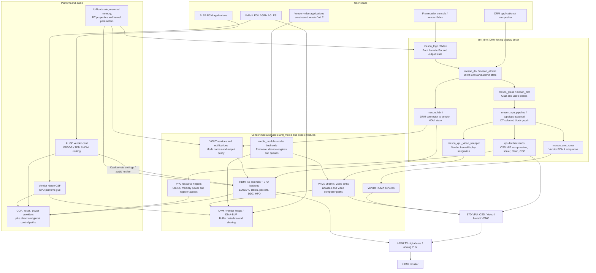
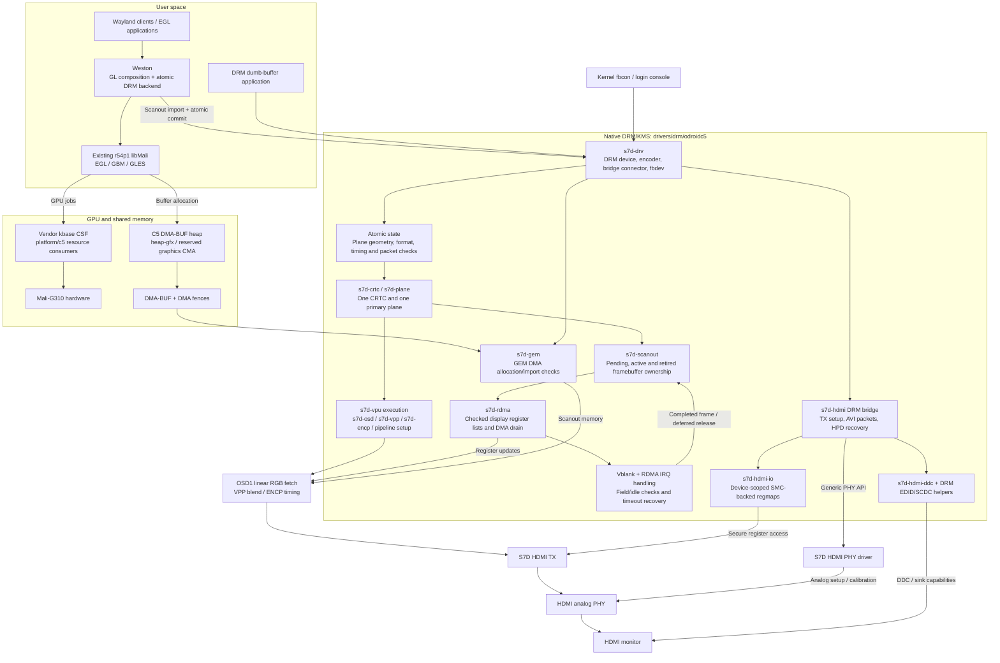
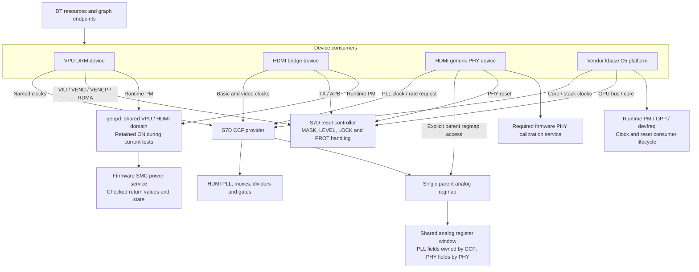
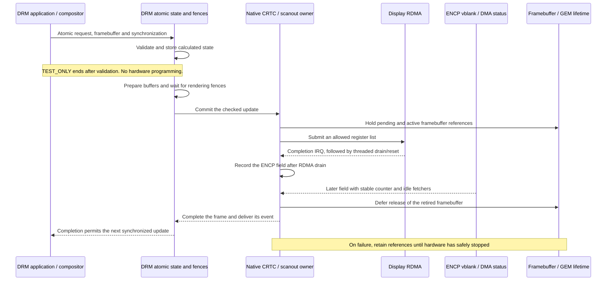
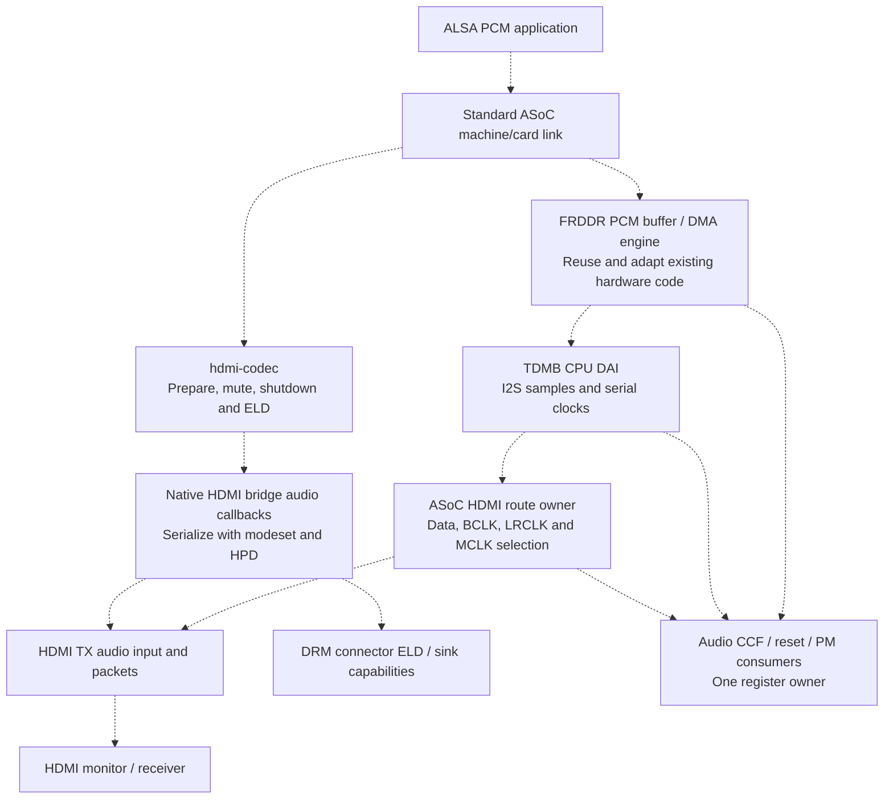

# ODROID-C5 Native Display Experiment

This repository is an experiment to understand and improve the existing Amlogic
display stack on the **ODROID-C5**, based on the **S905X5M / S7D** and Linux 6.12.
The work follows the existing drivers, device trees, hardware documentation and
observations on a real board to separate hardware ownership from display policy.

The aim is to replace the tightly coupled vendor display path with drivers that
use the kernel's DRM/KMS, CCF, reset, generic PHY, runtime PM and ASoC frameworks.
The implementation lives in `common_drivers`; using upstream kernel interfaces
does not mean that these drivers have been accepted upstream.

**Current result:** native SDR HDMI output, a framebuffer console, vendor Mali
rendering and an isolated Weston desktop session work on the test board. The
replacement is not yet feature-complete. HDMI PCM, 4K, full-rate page flips,
GNOME integration and independent cold display initialization remain open.

Status below reflects the source and recorded tests as of **2026-09-22**.

## Problems being addressed

- **Dependencies between `aml_drm` and `aml_media`.** The DRM interface reaches
  into vendor VOUT, HDMI, video-frame, RDMA and memory services. Decoding, display
  policy and hardware programming are difficult to change independently.
- **Distributed hardware ownership.** PHY, PLL, clock, reset and power operations
  are spread across global helpers, direct register accesses, firmware calls
  and provider drivers. A resource can have several software paths that affect it.
- **Dependence on boot-time configuration.** Output names, kernel parameters,
  vendor DT properties and inherited hardware state influence initialization.
  The reported mode can differ from the timing actually programmed in hardware.
- **Mode selection tied to vendor timing tables.** The HDMI path translates EDID
  modes through vendor VIC/name tables. Supporting a valid detailed timing can
  require changes beyond the DRM mode validation path.
- **Unclear buffer and interrupt lifetimes.** An RDMA interrupt, completion of a
  register update, the next displayed frame and the end of memory reads are
  different events. Releasing or reusing a buffer at the wrong boundary can
  corrupt output even when an atomic ioctl succeeds.
- **Audio coupling to display internals.** TDM preparation queries a vendor
  machine-card layout and uses HDMI notifications. A standard ASoC card cannot
  simply be substituted without separating those responsibilities.
- **Recovery depends on implicit state.** Probe ordering, missing interrupts,
  failed firmware calls and suspend/resume need explicit error handling and
  resource lifetimes rather than assumptions about the previous owner.

The vendor drivers already implement DRM properties, DMA-BUF and parts of CCF
and ASoC. The problem is the remaining coupling and inconsistent ownership, not
the absence of kernel frameworks throughout the existing stack.

## Design direction

| Area | Intended ownership and interface |
| --- | --- |
| Device description | DT describes registers, interrupts, clocks, resets, power domains, PHYs, reserved memory and graph connections. |
| Clocks and PLLs | CCF providers own the clock tree; devices request and release named clocks. |
| Reset | Reset controllers own reset registers; consumers request only the lines they use. |
| Power | genpd owns firmware power transitions; runtime PM tracks device use. |
| HDMI analog PHY | A generic PHY driver owns analog setup and calibration; PLL programming belongs to CCF. |
| VPU display | A DRM driver owns planes, CRTC state, OSD/blend, ENCP, vblank and display RDMA. |
| HDMI transmitter | A DRM bridge owns TX top/core access, DDC, HPD, SCDC and HDMI packets. |
| Buffers and synchronization | GEM DMA, DMA-BUF and DMA fences express allocation, sharing and completion. |
| HDMI audio | ASoC owns DMA/TDM/routing; `hdmi-codec` connects PCM and ELD to the HDMI bridge. |
| GPU | The existing vendor Mali kbase CSF ABI remains available to the deployed libMali binary. |

Boot strings such as `outputmode` must not override a checked DRM mode or an
observed hardware state. Removing those strings as a programming interface is
separate from removing dependence on firmware-initialized hardware. The latter
is **not complete**: the current display driver still requires a usable retained
HDMI state. Firmware SCMI/SMC services remain valid resources where the platform
requires them; U-Boot itself is not modified by this work.

Unsupported features must be rejected explicitly. A property, callback or
successful build is not sufficient evidence that the corresponding hardware
feature works.

## Existing vendor architecture

The following is a dependency and data-flow map of the relevant source paths.
It is not an exact runtime call trace. Some components are selected by Kconfig
and DT, and the shared vendor code supports hardware beyond the C5.

The DRM and video routes therefore share more than the final display hardware.
They also depend on vendor state, memory conventions and cross-subsystem
notifications. A DRM-only change can affect code that was originally designed
around a vendor video or boot-output path.

Useful entry points are [`drivers/drm`](drivers/drm),
[`drivers/media`](drivers/media), the
[`HDMI TX implementation`](drivers/media/vout/hdmi_tx_connector), and
[`AUGE audio`](sound/soc/amlogic/auge). Decoder implementations also live in the
separate `media_modules` repository in the parent kernel workspace.

## Native display architecture

The new display implementation is in
[`drivers/drm/odroidc5`](drivers/drm/odroidc5). Its build object is
`s7d-display`; the current integration is built into the kernel. It creates
separate DT devices for the VPU and HDMI bridge and uses the existing kernel
DRM framework. The vendor GPU driver remains in use.

### Implemented display and GPU path

Solid arrows below describe implemented connections. They show buffer, control
or hardware flow as labeled; they do not imply that every feature of a kernel
framework has been implemented or tested.

GPU rendering and display scanout are separate capabilities. The Weston tests
exercised GPU import/composition of client buffers, including a compressed
client-buffer layout, while KMS scanned out **linear XRGB8888**. This does not
establish AFBC scanout support in the new VPU driver.

### Resource ownership

The clock provider and PHY share a named parent regmap, not independently
mapped copies of the same analog window. Reset register reservations exclude
the watchdog window. The S7D genpd path validates firmware failures and avoids
the legacy direct power-control bypasses.

DDC and HPD retain their basic clock/power references independently of the
video PLL/PHY lifetime. Keeping the shared domain on does not prove that every
internal SRAM is powered or that a cold boot can be initialized safely.

### Atomic updates and framebuffer lifetime

This describes a running-plane update. Initial enable and full modesets have
separate stop/start paths. Current retirement remains conservative: it requires
a different ENCP field after RDMA drain and idle OSD/read-arbiter observations.
The tested serial update rate is about **30 fps on a 60 Hz output**, improved
from about 20 fps. Same-field latch safety and 60 fps updates are not yet proven.

## HDMI PCM: preparation completed, connection still pending

The bridge currently disables audio transmission. There is **no working native
HDMI PCM path yet**. Three preparatory fixes are implemented:

1. Standard ASoC cards no longer enter vendor HDMI routing through an invalid
   cast to the vendor machine-card structure.
2. The audio controller validates mapping boundaries and failures, and publishes
   its resources only after initialization succeeds.
3. TDM and the DDR manager use their parent device and defer probing while the
   controller is unavailable.

The target connection is shown below. **All dashed arrows are planned wiring,
not a report of working audio.**

Remaining audio work includes eliminating the legacy all-gates-on policy and
overlapping/global register ownership in the new path, implementing the route
and bridge callbacks, and testing two-channel LPCM at 44.1/48 kHz with 16/24-bit
samples. Mode changes, cable removal, reconnect and close must have defined
mute/recovery and resource-release behavior.

## Progress and validation

“Implemented” describes source. “Board-tested” describes the particular recorded
configuration and test; it is not a claim of complete vendor feature parity.

| Area | Current status | Evidence and limits |
| --- | --- | --- |
| Reset / watchdog | Implemented; board deployment tested | Split resource reservations and S7D reset semantics. Fault cases also covered with simulated MMIO. |
| Display CCF / PHY / genpd | Implemented for the current native path | Native output uses these consumers; shared display power remains on. Cold SRAM initialization and full power-off recovery remain open. |
| DRM/KMS SDR output | Board-tested | One CRTC, one opaque primary plane; 1080p60 and 59.94 Hz modes and repeated page flips. |
| Linear RGB layouts | Implemented and board-tested | XRGB8888, XBGR8888, RGBX8888 and BGRX8888. No scaling, alpha composition or compressed KMS scanout yet. |
| EDID and mode validation | Implemented | DRM EDID parsing, timing validation and sink/driver clock limits replace the vendor name/VIC selection route. Arbitrary timing interoperability is not fully qualified. |
| RDMA / framebuffer lifetime | Implemented and exercised on board | Kernel #44 completed 240 flips across four 60/59.94 Hz runs and 60 more after s2idle. Host tests cover ordering, wrap, busy DMA and faults. |
| Server framebuffer console | Board-tested | Native fbcon/login output and return from graphics applications; visual confirmation received. |
| Vendor GPU / libMali | Board-tested for the tested binary | Mali-G310 rendering, visible rotating cube, DMA-BUF export/import, pixel readback and native fences. |
| Weston | Board-tested in an isolated root session | Cursor, window movement, terminal launch and keyboard input confirmed. Kernel #44 sustained about 30 fps. Non-root seat/login and VT handling remain to be qualified. |
| Suspend-to-idle | Board-tested for the retained-domain configuration | RTC-woken resume, restored KMS, subsequent flips and GPU buffer/fence tests. Deep sleep and hibernation are rejected. |
| HDMI PCM foundations | Source/build-tested only | Card ownership, controller registration and TDM/DDR probe fixes. AUGE relocatable-object compilation is not a final module-load or audio-output test. |
| GNOME / GDM | Pending | Weston success does not establish Mutter, GDM, user-session or desktop-login compatibility. |
| 4K / HDR / additional planes | Pending | Current mode limits are 1920×1080 and 148.5 MHz, RGB8 SDR. |
| Boot continuity / simpledrm | Deferred | Existing reservations are preserved; end-to-end logo-to-login continuity is not implemented. |
| New V4L2 / amstream integration | Deferred | Decoder migration and shared-core design must include `media_modules`. |

The tested userspace GPU package is
`libmali-valhall-g310-r54p1-wayland-gbm`, version `26.03+202605111356`.
The current experiment keeps vendor kbase as its GPU path; Panthor/Panfrost
integration is outside the active scope.

The #44 log results above include normal compositor exit, console state
restoration and no recorded display stop/timeout errors. Visual confirmation
for that exact build was still pending when this status was written. Earlier
builds have explicit visual confirmations for the native console and GPU/Weston
output. TEST_ONLY smoke tests checked reported CRTC state; a complete hardware
register/resource audit is still required.

## Source layout and build integration

| Location | Responsibility |
| --- | --- |
| [`drivers/drm/odroidc5`](drivers/drm/odroidc5) | Native DRM device, plane/CRTC, VPU execution, display RDMA, buffer lifetime, HDMI bridge and DDC. |
| [`drivers/clk/meson/s7d.c`](drivers/clk/meson/s7d.c) and [`s7d-hdmi-pll.c`](drivers/clk/meson/s7d-hdmi-pll.c) | S7D clock provider, display clock routing and HDMI PLL planning/programming. |
| [`drivers/phy/amlogic/phy-meson-s7d-hdmi.c`](drivers/phy/amlogic/phy-meson-s7d-hdmi.c) | Generic HDMI PHY and required calibration interface. |
| [`drivers/reset/reset-meson.c`](drivers/reset/reset-meson.c) | Reset provider and S7D protection/status handling. |
| [`drivers/power/sec_power_domain.c`](drivers/power/sec_power_domain.c) | Firmware-backed power domains and S7D error handling. |
| [`drivers/gpu/arm/midgard/platform/c5`](drivers/gpu/arm/midgard/platform/c5) | C5 platform integration for the existing vendor kbase driver. |
| [`drivers/dma-buf/heaps/c5-scanout-heap.c`](drivers/dma-buf/heaps/c5-scanout-heap.c) | Standard DMA-BUF heap preserving the `heap-gfx` name required by libMali. |
| [`sound/soc/amlogic/auge`](sound/soc/amlogic/auge) | Existing audio hardware implementation and initial decoupling fixes. Native PCM integration is unfinished. |
| [`meson-s7d-odroidc5.dtsi`](arch/arm64/boot/dts/amlogic/meson-s7d-odroidc5.dtsi) | C5 native resources, GPU, memory reservations and display graph. |
| [`s7d_s905x5m_odroidc5.dts`](arch/arm64/boot/dts/amlogic/s7d_s905x5m_odroidc5.dts) | Board entry point; produces the standard `s7d_s905x5m_odroidc5.dtb`. |

This repository is used inside the parent Linux kernel workspace. The parent
contains `arch/arm64/configs/odroidc5_defconfig` and `build.config.odroidc5`.
The latter records the kernel, modules and standard board DTB build targets.
There is no separate native-display board DTB in the intended configuration.

The principal native options are `CONFIG_AMLOGIC_C5_DISPLAY_RESOURCES`,
`CONFIG_AMLOGIC_C5_NATIVE_DISPLAY`, `CONFIG_AMLOGIC_C5_GPU_KBASE` and
`CONFIG_DMABUF_HEAPS_C5_SCANOUT`. Their Kconfig definitions live with their
respective drivers. Kconfig exclusions and the C5 DT disable competing legacy
display owners; the native VPU and vendor display writers must not run together.

Local test programs, logs and working notes are kept outside the committed
driver series. Their absence from a checkout must not be interpreted as an
automated or reproducible hardware certification suite.

## Remaining work

1. **Complete the native display and desktop path.** Establish safe 60 fps
   updates, validate long-running flips, IRQ recovery and TEST_ONLY isolation,
   and qualify GNOME/GDM, non-root sessions, VT switching and hotplug behavior.
2. **Connect HDMI PCM through ASoC.** Finish audio register ownership,
   clock/reset/PM consumers, FRDDR/TDMB routing, `hdmi-codec`, ELD and recovery
   during playback and display transitions.
3. **Extend display feature coverage.** Add 4K30/60, additional planes,
   scaling/blending, supported YUV paths and compressed modifiers according to
   the actual S7D topology and bandwidth limits. Validate RGB range and color
   conversion rather than merely exposing properties.
4. **Remove remaining initialization assumptions.** Resolve the conflicting
   HDMI SRAM power descriptions, verify cold initialization and restore lost
   state before enabling domain power-off, deep sleep or hibernation. Do not
   guess a memory-power bit or claim that domain ON guarantees usable SRAM.
5. **Return to boot continuity after the native path is complete.** Analyze
   U-Boot's retained scanout and reservations, integrate the existing kernel
   simpledrm/simple-framebuffer mechanism, and verify ownership transfer through
   logo, kernel console or Plymouth, and server/desktop login. Release reserved
   memory only after all scanout/RDMA references and memory ownership permit it.
6. **Add HDR and revisit media integration.** Evaluate HDR10/HLG as complete
   10-bit, color-processing, metadata and packet paths. Separately design a
   common decoder core for stateful V4L2 M2M, vendor V4L2 extensions and amstream,
   including firmware, buffer/fence, timestamp and engine ownership across
   `common_drivers` and `media_modules`.

The compatibility target is hardware-supported, non-protected functionality
provided through standard kernel interfaces, together with the required vendor
GPU and future decoding APIs. It does not include HDMI input, Dolby/Netflix
integration, HDCP-protected content, or unchanged compatibility with the old
amvideo direct-display API and every vendor player binary. CEC, encoders,
HDR10+ and VRR remain follow-up work.
