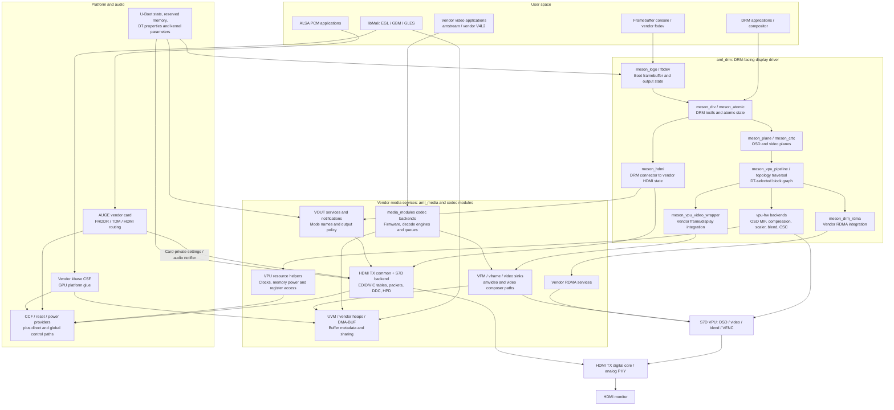
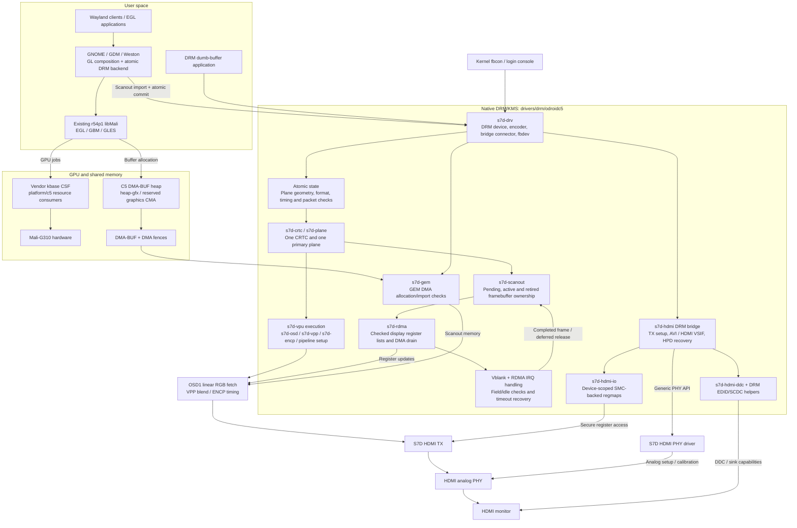
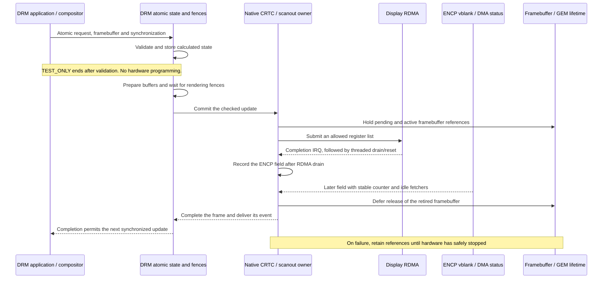
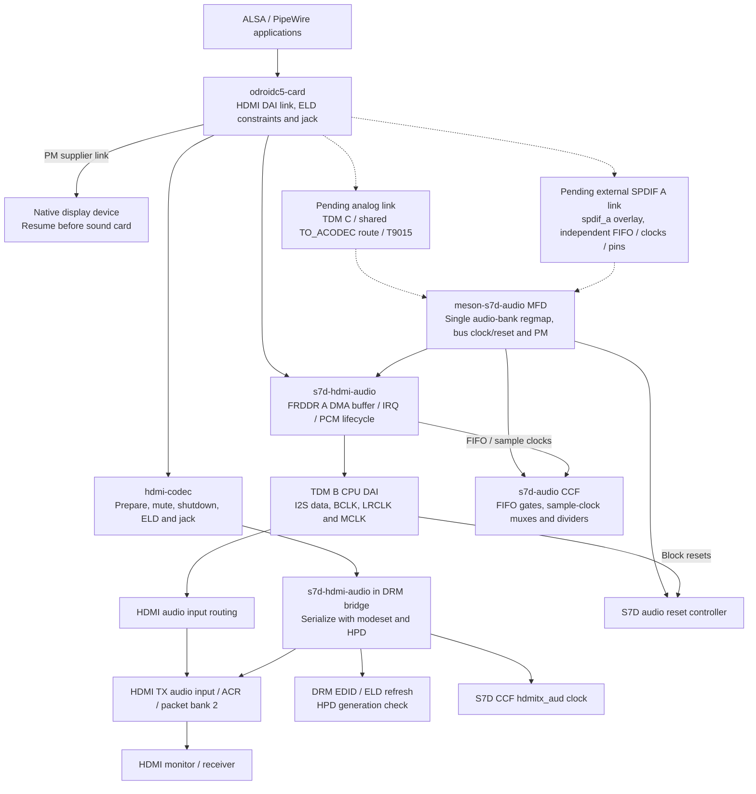

# ODROID-C5 Native Display Experiment

This repository is an experiment to understand and improve the existing Amlogic
display stack on the **ODROID-C5**, based on the **S905X5M / S7D** and Linux 6.12.
The work follows the existing drivers, device trees, hardware documentation and
observations on a real board to separate hardware ownership from display policy.

The aim is to replace the tightly coupled vendor display path with drivers that
use the kernel's DRM/KMS, CCF, reset, generic PHY, runtime PM and ASoC frameworks.
The implementation lives in `common_drivers`; using upstream kernel interfaces
does not mean that these drivers have been accepted upstream.

**Current result:** native RGB8 SDR HDMI output now reaches **3840×2160 at
60 Hz**, with GNOME/GDM using the existing vendor Mali driver and DMA-BUF
scanout. Native HDMI stereo PCM has audible left/right confirmation. Tests also
cover fractional 4K modes, PCM across modesets and recovery of an open PCM
stream after suspend-to-idle. These results do not establish full vendor parity,
60 fps presentation, or initialization without retained firmware state.

Status below reflects the source and recorded tests as of **2026-09-30**,
including kernel **#59**. Analog audio and overlay-enabled external SPDIF remain
to be connected to the native audio framework. A stalled normal reboot is under
investigation; the board recovered after a forced reboot.

## Problems being addressed

- **Dependencies between `aml_drm` and `aml_media`.** The DRM interface reaches
  into vendor VOUT, HDMI, video-frame, RDMA and memory services. Decoding, display
  policy and hardware programming are difficult to change independently.
- **Distributed hardware ownership.** PHY, PLL, clock, reset and power operations
  are spread across global helpers, direct register accesses, firmware calls
  and provider drivers. A resource can have several software paths that affect it.
- **Dependence on boot-time configuration.** Output names, kernel parameters,
  vendor DT properties and inherited hardware state influence initialization.
  The reported mode can differ from the timing actually programmed in hardware.
- **Mode selection tied to vendor timing tables.** The HDMI path translates EDID
  modes through vendor VIC/name tables. Supporting a valid detailed timing can
  require changes beyond the DRM mode validation path.
- **Unclear buffer and interrupt lifetimes.** An RDMA interrupt, completion of a
  register update, the next displayed frame and the end of memory reads are
  different events. Releasing or reusing a buffer at the wrong boundary can
  corrupt output even when an atomic ioctl succeeds.
- **Audio coupling to display internals.** TDM preparation queries a vendor
  machine-card layout and uses HDMI notifications. A standard ASoC card cannot
  simply be substituted without separating those responsibilities.
- **Recovery depends on implicit state.** Probe ordering, missing interrupts,
  failed firmware calls and suspend/resume need explicit error handling and
  resource lifetimes rather than assumptions about the previous owner.

The vendor drivers already implement DRM properties, DMA-BUF and parts of CCF
and ASoC. The problem is the remaining coupling and inconsistent ownership, not
the absence of kernel frameworks throughout the existing stack.

## Design direction

| Area | Intended ownership and interface |
| --- | --- |
| Device description | DT describes registers, interrupts, clocks, resets, power domains, PHYs, reserved memory and graph connections. |
| Clocks and PLLs | CCF providers own the clock tree; devices request and release named clocks. |
| Reset | Reset controllers own reset registers; consumers request only the lines they use. |
| Power | genpd owns firmware power transitions; runtime PM tracks device use. |
| HDMI analog PHY | A generic PHY driver owns analog setup and calibration; PLL programming belongs to CCF. |
| VPU display | A DRM driver owns planes, CRTC state, OSD/blend, ENCP, vblank and display RDMA. |
| HDMI transmitter | A DRM bridge owns TX top/core access, DDC, HPD, SCDC and HDMI packets. |
| Buffers and synchronization | GEM DMA, DMA-BUF and DMA fences express allocation, sharing and completion. |
| HDMI audio | ASoC owns DMA/TDM/routing; `hdmi-codec` connects PCM and ELD to the HDMI bridge. |
| GPU | The existing vendor Mali kbase CSF ABI remains available to the deployed libMali binary. |

Boot strings such as `outputmode` must not override a checked DRM mode or an
observed hardware state. Removing those strings as a programming interface is
separate from removing dependence on firmware-initialized hardware. The latter
is **not complete**: the current display driver still requires a usable retained
HDMI state. Firmware SCMI/SMC services remain valid resources where the platform
requires them; U-Boot itself is not modified by this work.

Unsupported features must be rejected explicitly. A property, callback or
successful build is not sufficient evidence that the corresponding hardware
feature works.

## Existing vendor architecture

The following is a dependency and data-flow map of the relevant source paths.
It is not an exact runtime call trace. Some components are selected by Kconfig
and DT, and the shared vendor code supports hardware beyond the C5.

The DRM and video routes therefore share more than the final display hardware.
They also depend on vendor state, memory conventions and cross-subsystem
notifications. A DRM-only change can affect code that was originally designed
around a vendor video or boot-output path.

Useful entry points are [`drivers/drm`](drivers/drm),
[`drivers/media`](drivers/media), the
[`HDMI TX implementation`](drivers/media/vout/hdmi_tx_connector), and
[`AUGE audio`](sound/soc/amlogic/auge). Decoder implementations also live in the
separate `media_modules` repository in the parent kernel workspace.

## Native display architecture

The new display implementation is in
[`drivers/drm/odroidc5`](drivers/drm/odroidc5). Its build object is
`s7d-display`; the current integration is built into the kernel. It creates
separate DT devices for the VPU and HDMI bridge and uses the existing kernel
DRM framework. The vendor GPU driver remains in use.

### Implemented display and GPU path

Solid arrows below describe implemented connections. They show buffer, control
or hardware flow as labeled; they do not imply that every feature of a kernel
framework has been implemented or tested.

GPU rendering and display scanout are separate capabilities. The Weston tests
exercised GPU import/composition of client buffers, including a compressed
client-buffer layout, while KMS scanned out **linear XRGB8888**. This does not
establish AFBC scanout support in the new VPU driver.

### Resource ownership

The clock provider and PHY share a named parent regmap, not independently
mapped copies of the same analog window. Reset and watchdog reservations do
not overlap. The reduced S7D reset change preserves MASK, rejects masked
assertions and checks LEVEL writes; it does not map LOCK/PROT registers or
rewrite the legacy pulse-reset path. The S7D genpd path validates firmware
failures and avoids the legacy direct power-control bypasses.

The VPU holds an exclusive core-clock rate reference during active scanout and
checks that the rate can sustain the requested pixel clock. The current board
retains a 666.7 MHz VPU core clock. Complete clock-path independence, including
PNX routing, and qualification under memory-bandwidth contention remain open.

DDC and HPD retain their basic clock/power references independently of the
video PLL/PHY lifetime. Keeping the shared domain on does not prove that every
internal SRAM is powered or that a cold boot can be initialized safely.

### Atomic updates and framebuffer lifetime

This describes a running-plane update. Initial enable and full modesets have
separate stop/start paths. Current retirement remains conservative: it requires
a different ENCP field after RDMA drain and idle OSD/read-arbiter observations.
The earlier measured serial update rate was about **30 fps on a 60 Hz output**,
improved from about 20 fps. The newer 4K tests establish working page flips,
not one new framebuffer per refresh. Same-field latch safety and sustained
60 fps presentation are not yet proven.

## Native audio: HDMI connected, analog and SPDIF pending

The C5 has **three output targets**: HDMI, onboard analog, and external SPDIF A
selected through the existing `spdif_a` overlay. The native card currently
exposes HDMI only. The monolithic vendor audio bus/card and T9015 codec are
disabled in this configuration; enabling the overlay alone does not yet provide
a working native SPDIF path.

The implemented HDMI path uses a single audio-bank regmap, child CCF/reset
providers, a native FRDDR A / TDM B transport, the ODROID-C5 ASoC card and
`hdmi-codec`. It does not use the vendor card-private structure or HDMI notifier
for PCM routing. The MFD parent keeps the register interface available to its
children; each stream owns its transport and sample-clock references.

Solid arrows below are implemented. Dashed arrows describe pending audio links.

HDMI supports two-channel LPCM at 44.1/48 kHz with 16/24-bit samples, restricted
by the connected sink's ELD. Format and rate constraints are applied together
at PCM startup, so PipeWire can negotiate a supported format. The AOC test
monitor advertised 16-bit audio only: 16-bit playback passed and 24-bit requests
were rejected. Physical 24-bit output remains unqualified.

Basic left/right sound was confirmed on the board. Zero-sample streams also
passed modesets, display DPMS and RTC-woken suspend-to-idle. Sleep recovery
uses ALSA prepare/restart on the same open handle; it is not sample-continuous
DMA through sleep. Kernel-owned ELD refresh allows recovery before a compositor
queries modes. On close, transport and TX audio clocks stop and the PCM runtime
PM reference returns to zero; the shared register-bank parent remains available.
Audible continuity through transitions and physical cable unplug/replug still
need qualification.

## Progress and validation

“Implemented” describes source. “Board-tested” describes the particular recorded
configuration and test; it is not a claim of complete vendor feature parity.

| Area | Current status | Evidence and limits |
| --- | --- | --- |
| Reset / watchdog | Minimal S7D provider change; board boots | MASK/LEVEL status and checked writes; separate register reservations. Host fault tests cover all 192 reset IDs. Booting is not a watchdog-expiry test. |
| Display CCF / PHY / genpd | Implemented for the current native path | Native clock/PHY consumers, firmware error handling and high-rate PHY profiles; shared display power stays on. Cold SRAM initialization and full power-off recovery remain open. |
| DRM/KMS SDR output | Board-tested through 4K60 | One CRTC and one opaque primary plane. #59 completed 60 page flips per run at 1080p60 and 4K30/29.97/60/59.94, then returned to 1080p60. |
| Linear RGB layouts | Implemented and board-tested | XRGB8888, XBGR8888, RGBX8888 and BGRX8888. S7D VENC component mapping was corrected; the user confirmed normal GNOME colors on #46. No scaling, alpha composition or compressed KMS scanout yet. |
| EDID / HDMI link | Implemented; selected modes board-tested | DRM timing and sink checks, RGB8 TMDS up to 594 MHz, SCDC scrambling above 340 MHz and HDMI VSIF packets. High-rate tests read back scrambling and channel-lock status. DVI and broader sink coverage remain to be qualified. |
| Fractional clocks | Board-tested with updated clock module | CCF divider rounding now accepts the PLL's nearest rate for 4K59.94. The loaded #59 module build ID and installed initramfs were verified after reboot. |
| RDMA / framebuffer lifetime | Implemented and exercised on board | #59 display CMA use was unchanged across the flip sequence. Display CMA is 192 MiB for 4K buffers. Conservative retirement remains; sustained 60 fps is not established. |
| Framebuffer console | Board-tested | Native fbcon/login output and return from graphics applications; visual confirmation received. |
| Vendor GPU / libMali | Board-tested for the deployed binary | Mali-G310 rendering, DMA-BUF import/export, pixel readback and fences. GNOME and Weston use the native KMS scanout path. |
| Weston | Board-tested | Cursor, window movement, terminal launch and keyboard input confirmed. The earlier #44 run sustained about 30 fps. |
| GNOME / GDM | Board-tested on Ubuntu 26.04 / GNOME 50.1 | Non-root desktop login, terminal, cursor and window dragging confirmed with vendor Mali. The user confirmed a correct 4K60 picture on #58; #59 restores GDM at 4K60 with imported GPU scanout. Smoothness is not qualified. |
| HDMI PCM | Board-tested; audible stereo confirmed | 44.1/48 kHz S16 transfers, PipeWire negotiation and close-time PM/clock release. 24-bit support is implemented but needs a capable sink and physical validation. |
| PCM during modesets / DPMS | Board-tested using silence | #55 lower-resolution mode and DPMS tests; #59 PCM remained open through 4K30/29.97, 2560×1440, 4K59.94 and 4K60. No reported underrun; audible continuity is not established. |
| Suspend-to-idle | Board-tested with retained display domain | #56 recovered open 44.1/48 kHz PCM streams even while GNOME was stopped, using fresh ELD and ordered device resume. 4K sleep recovery, deep sleep and hibernation are not qualified. |
| Analog / external SPDIF | Pending | Preserve three distinct output targets. Native TDM C/T9015 and overlay-controlled SPDIF A links are not yet implemented. |
| Boot continuity / simpledrm | Deferred | Retained-state checks and reservations remain; independent cold initialization and seamless logo-to-login continuity are unfinished. |
| HDR / additional planes / new media APIs | Deferred | Current scanout is RGB8 SDR. HDR, YUV, scaling, compressed scanout and decoder API migration remain outside the working path. |

The tested userspace GPU package is
`libmali-valhall-g310-r54p1-wayland-gbm`, version `26.03+202605111356`.
The current experiment keeps vendor kbase as its GPU path; Panthor/Panfrost
integration is outside the active scope. The test image's `libmali-setup` script
was adjusted to recognize `fd000000.gpu` in addition to its old node name; the
libMali binary was unchanged. That packaging adjustment still needs integration
into the distribution package source. Mutter uses implicit synchronization in
this setup; its explicit syncobj path was not activated. There is no hardware
cursor plane.

### Source/build checks versus board evidence

ARM64 kernel Image, modules and the standard board DTB build successfully.
Local tests exercise production timing/PLL calculations, divider rounding,
HDMI packet and SCDC programming, DMA-safe DDC transfers, audio/ELD rules,
framebuffer lifetime and failure handling. These simulated fault tests do not
prove how silicon behaves under the same faults.

The #59 board tests verified the new KMS path, not the legacy vendor output.
TEST_ONLY smoke tests checked unchanged reported CRTC state; a complete hardware
register/resource audit is still required. The fractional-mode flip tests did
not obtain a separate visual confirmation for every mode. User-confirmed 4K60
picture quality applies to #58, while the recorded #59 tests verify fractional
rates, link status and PCM/modeset operation after the clock module update.

### Known operational issues

A normal reboot stalled after the #59 clock-module/initramfs update; the user
forced a reboot and the subsequent display/audio tests passed. The old boot's
journal ends during service shutdown, with no surviving pstore evidence that
identifies the cause. The new clock module was not yet loaded in that boot,
so its divider change is not an established cause. Capture the shutdown over
UART before assigning the failure to a driver. UART was unavailable on the host
at the latest check.

The test image has also shown an intermittent Ethernet/networkd startup race,
and its root filesystem was nearly full at the last check. Neither observation
has been established as the cause of the reboot stall. Repeated unattended
reboot and long-running desktop qualification remain open.

## Source layout and build integration

| Location | Responsibility |
| --- | --- |
| [`drivers/drm/odroidc5`](drivers/drm/odroidc5) | Native DRM device, plane/CRTC, VPU execution, display RDMA, buffer lifetime, HDMI bridge and DDC. |
| [`drivers/clk/meson/s7d.c`](drivers/clk/meson/s7d.c) and [`s7d-hdmi-pll.c`](drivers/clk/meson/s7d-hdmi-pll.c) | S7D clock provider, display clock routing and HDMI PLL planning/programming. |
| [`drivers/phy/amlogic/phy-meson-s7d-hdmi.c`](drivers/phy/amlogic/phy-meson-s7d-hdmi.c) | Generic HDMI PHY and required calibration interface. |
| [`drivers/reset/reset-meson.c`](drivers/reset/reset-meson.c) | Reset provider and S7D protection/status handling. |
| [`drivers/power/sec_power_domain.c`](drivers/power/sec_power_domain.c) | Firmware-backed power domains and S7D error handling. |
| [`drivers/gpu/arm/midgard/platform/c5`](drivers/gpu/arm/midgard/platform/c5) | C5 platform integration for the existing vendor kbase driver. |
| [`drivers/dma-buf/heaps/c5-scanout-heap.c`](drivers/dma-buf/heaps/c5-scanout-heap.c) | Standard DMA-BUF heap preserving the `heap-gfx` name required by libMali. |
| [`drivers/mfd/meson-s7d-audio.c`](drivers/mfd/meson-s7d-audio.c) | Single audio-bank mapping, parent bus resources and child devices. |
| [`drivers/clk/meson/s7d-audio.c`](drivers/clk/meson/s7d-audio.c) and [`drivers/reset/reset-meson-s7d-audio.c`](drivers/reset/reset-meson-s7d-audio.c) | Shared audio clock and reset providers. |
| [`sound/soc/meson/s7d-hdmi-audio.c`](sound/soc/meson/s7d-hdmi-audio.c) | Native FRDDR A / TDM B PCM transport and HDMI input routing. |
| [`sound/soc/meson/odroidc5-card.c`](sound/soc/meson/odroidc5-card.c) | Board DAI links, HDMI sink constraints, jack and display/audio sleep ordering. |
| [`drivers/drm/odroidc5/s7d-hdmi-audio.c`](drivers/drm/odroidc5/s7d-hdmi-audio.c) | HDMI codec callbacks, ACR/audio packets, mute and ELD recovery. |
| [`sound/soc/amlogic/auge`](sound/soc/amlogic/auge) | Vendor reference implementation and limited existing-driver fixes; not the native PCM transport. |
| [`meson-s7d-odroidc5.dtsi`](arch/arm64/boot/dts/amlogic/meson-s7d-odroidc5.dtsi) | C5 native resources, GPU, memory reservations and display graph. |
| [`s7d_s905x5m_odroidc5.dts`](arch/arm64/boot/dts/amlogic/s7d_s905x5m_odroidc5.dts) | Board entry point; produces the standard `s7d_s905x5m_odroidc5.dtb`. |

This repository is used inside the parent Linux kernel workspace. The parent
contains `arch/arm64/configs/odroidc5_defconfig` and `build.config.odroidc5`.
The latter records the kernel, modules and standard board DTB build targets.
There is no separate native-display board DTB in the intended configuration.

The principal native options are `CONFIG_AMLOGIC_C5_DISPLAY_RESOURCES`,
`CONFIG_AMLOGIC_C5_NATIVE_DISPLAY`, `CONFIG_AMLOGIC_C5_GPU_KBASE` and
`CONFIG_DMABUF_HEAPS_C5_SCANOUT`. Their Kconfig definitions live with their
respective drivers. Native audio adds `CONFIG_MFD_MESON_S7D_AUDIO`,
`CONFIG_RESET_MESON_S7D_AUDIO`, `CONFIG_COMMON_CLK_MESON_S7D_AUDIO`,
`CONFIG_SND_SOC_MESON_S7D_HDMI_AUDIO` and `CONFIG_SND_SOC_ODROIDC5`.
Kconfig exclusions and the C5 DT disable competing legacy display and audio
owners; the native and vendor paths must not program the same blocks together.

Deploy the matching modules as well as Image and DTB. In the tested configuration
`CONFIG_AMLOGIC_COMMON_CLK_S7D=m`, and the clock module is included in initramfs.
Replacing Image alone leaves that clock implementation unchanged; verify the
loaded module when testing a CCF change.

Local test programs, logs and working notes are kept outside the committed
driver series. Their absence from a checkout must not be interpreted as an
automated or reproducible hardware certification suite.

## Remaining work

1. **Stabilize the working display path.** Diagnose the reboot stall with UART,
   qualify repeated modesets/reboots, long-running GNOME, VT transitions and
   physical HDMI unplug/replug, and complete TEST_ONLY resource isolation and
   IRQ/failure recovery checks. Establish safe full-rate presentation separately
   from a 60 Hz link.
2. **Complete the three audio outputs.** Add the analog TDM C/T9015 route and
   external SPDIF A overlay support using the shared providers and separate
   per-port resources. Extend HDMI testing to audible recovery, 24-bit sinks,
   cable reconnect and 4K suspend/resume; do not impose HDMI ELD constraints on
   analog or SPDIF links.
3. **Broaden display and sink coverage.** Qualify 4K and fractional timings on
   more sinks, DVI, custom EDID timings, link failures and memory contention.
   Then add planes, scaling/blending, YUV and compressed modifiers according to
   the actual S7D topology. Validate color conversion and bandwidth rather than
   merely exposing properties or accepting a mode.
4. **Remove remaining initialization assumptions.** Complete clock-path
   ownership, including PNX; resolve the conflicting HDMI SRAM power descriptions
   and verify cold initialization. Restore lost state before enabling shared
   domain power-off, deep sleep or hibernation. Do not guess a memory-power bit
   or claim that domain ON guarantees usable SRAM.
5. **Return to boot continuity after the native path is stable.** Analyze
   U-Boot's retained scanout and reservations, integrate the kernel's
   simpledrm/simple-framebuffer mechanism, and verify ownership transfer through
   logo, console or Plymouth, and login. Release reserved memory only after all
   scanout/RDMA references and memory ownership permit it. U-Boot modification
   remains outside the current scope.
6. **Add HDR and revisit media integration.** Evaluate HDR10/HLG as complete
   10-bit, color-processing, metadata and packet paths. Separately design a
   common decoder core for stateful V4L2 M2M, vendor V4L2 extensions and amstream,
   including firmware, buffer/fence, timestamp and engine ownership across
   `common_drivers` and `media_modules`.

The compatibility target is hardware-supported, non-protected functionality
provided through standard kernel interfaces, together with the required vendor
GPU and future decoding APIs. It does not include HDMI input, Dolby/Netflix
integration, HDCP-protected content, or unchanged compatibility with the old
amvideo direct-display API and every vendor player binary. CEC, encoders,
HDR10+ and VRR remain follow-up work.
